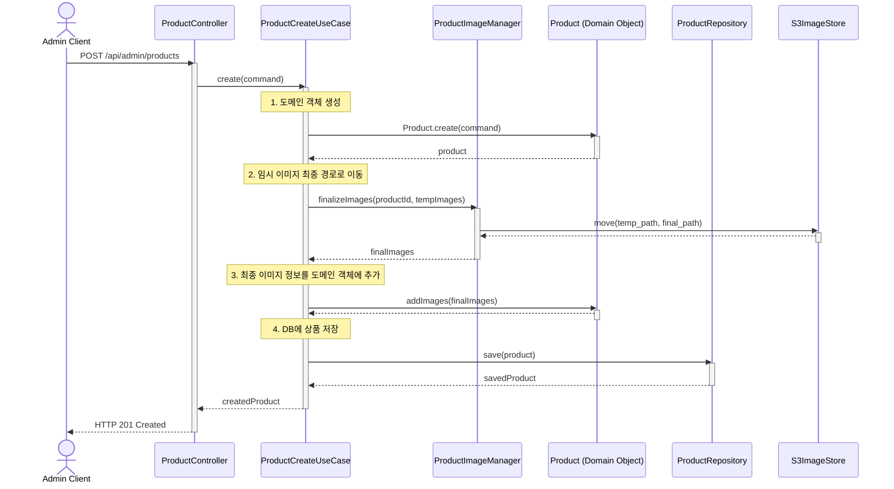

# 상품 등록 기능 시퀀스 다이어그램

아래 다이어그램은 상품 등록 기능의 전체적인 흐름을 보여줍니다. 상품 정보와 함께 임시 업로드된 이미지 정보를 받아 최종적으로 상품을 생성합니다.

### 다이어그램 흐름 설명

1.  **Admin Client**가 상품 정보와 임시 이미지 정보가 담긴 요청을 보냅니다.
2.  **ProductController**는 요청을 받아 **ProductCreateUseCase**를 호출합니다.
3.  **ProductCreateUseCase**는 다음을 순서대로 실행합니다.
    a.  `Product.create()` 정적 팩토리 메서드를 호출하여 **도메인 객체**를 생성합니다.
    b.  **ProductImageManager**를 통해 임시 경로의 이미지들을 S3의 최종 저장 경로로 이동시킵니다.
    c.  이동이 완료된 최종 이미지 정보(`finalImages`)를 `product.addImages()`를 통해 도메인 객체에 추가합니다.
    d.  완성된 `Product` 객체를 **ProductRepository**를 통해 데이터베이스에 저장합니다.
4.  모든 작업이 성공하면, **Controller**는 생성된 상품 정보와 함께 성공 응답(`HTTP 201 Created`)을 반환합니다.
