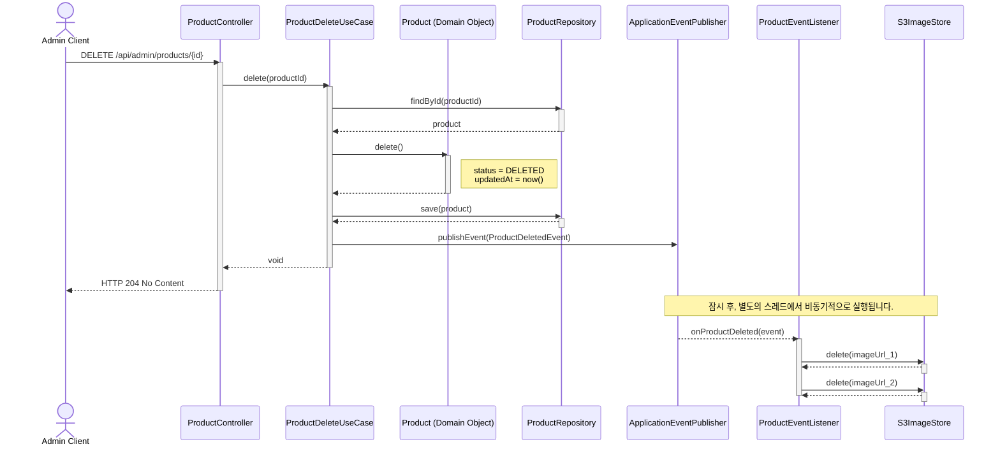

# 상품 삭제 기능 시퀀스 다이어그램

아래 다이어그램은 상품 삭제 기능의 전체적인 흐름을 보여줍니다. 사용자 요청을 처리하는 동기적 흐름과, 이벤트 기반으로 S3 이미지를 삭제하는 비동기적 흐름으로 구성됩니다.

### 다이어그램 흐름 설명

#### Part 1: 동기적 흐름 (사용자 요청 처리)
1.  **Admin Client**가 API 서버에 상품 삭제를 요청합니다 (`DELETE /api/admin/products/{id}`).
2.  **ProductController**는 요청을 받아 **ProductDeleteUseCase**를 호출합니다.
3.  **ProductDeleteUseCase**는 다음을 순서대로 실행합니다.
    a.  **ProductRepository**를 통해 DB에서 `Product` 영속성 객체를 조회합니다.
    b.  조회된 `Product` **도메인 객체**의 `delete()` 메서드를 호출하여 상태를 `DELETED`로 변경합니다.
    c.  변경된 `Product` 객체를 **ProductRepository**를 통해 DB에 저장(UPDATE)합니다.
    d.  **ApplicationEventPublisher**를 통해 `ProductDeletedEvent`를 발행합니다.
4.  모든 DB 작업이 성공적으로 완료되면, **Controller**는 클라이언트에게 성공 응답 (`HTTP 204 No Content`)을 보냅니다. **여기까지가 사용자가 인지하는 작업의 끝입니다.**

#### Part 2: 비동기적 흐름 (이벤트 처리)
1.  Spring의 **ApplicationEventPublisher**는 별도의 스레드에서 이벤트를 처리할 **ProductEventListener**를 호출합니다.
2.  **ProductEventListener**는 이벤트에 담긴 상품 이미지 정보들을 바탕으로, **S3ImageStore**를 통해 S3에 저장된 물리적 파일들을 순차적으로 삭제합니다. 이 작업은 사용자 응답 시간에 영향을 주지 않습니다.
