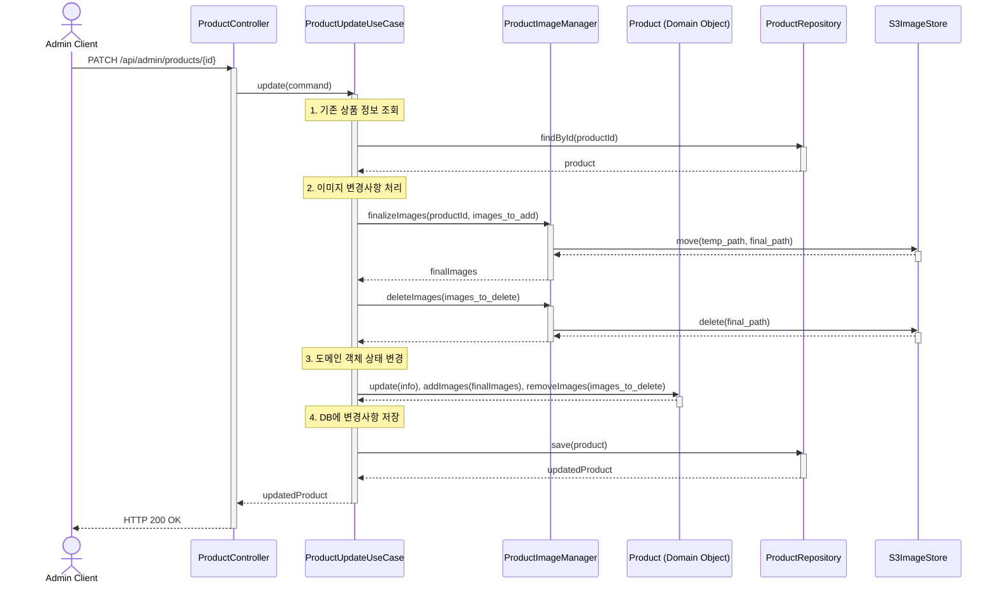

# 상품 수정 기능 시퀀스 다이어그램

아래 다이어그램은 상품 수정 기능의 전체적인 흐름을 보여줍니다. 상품의 기본 정보와 함께 추가/삭제될 이미지 정보를 받아 상품을 수정합니다.

### 다이어그램 흐름 설명

1.  **Admin Client**가 수정할 상품 정보와 추가/삭제할 이미지 정보를 담아 요청을 보냅니다.
2.  **ProductController**는 요청을 받아 **ProductUpdateUseCase**를 호출합니다.
3.  **ProductUpdateUseCase**는 다음을 순서대로 실행합니다.
    a.  **ProductRepository**를 통해 수정할 `Product` 객체를 조회합니다.
    b.  **ProductImageManager**를 호출하여, 추가할 이미지는 S3의 최종 경로로 이동시키고 삭제할 이미지는 S3에서 제거합니다.
    c.  `product.update()` 등 관련 메서드를 호출하여 **도메인 객체**의 상태를 변경합니다.
    d.  변경된 `Product` 객체를 **ProductRepository**를 통해 데이터베이스에 저장합니다.
4.  모든 작업이 성공하면, **Controller**는 수정된 상품 정보와 함께 성공 응답(`HTTP 200 OK`)을 반환합니다.
