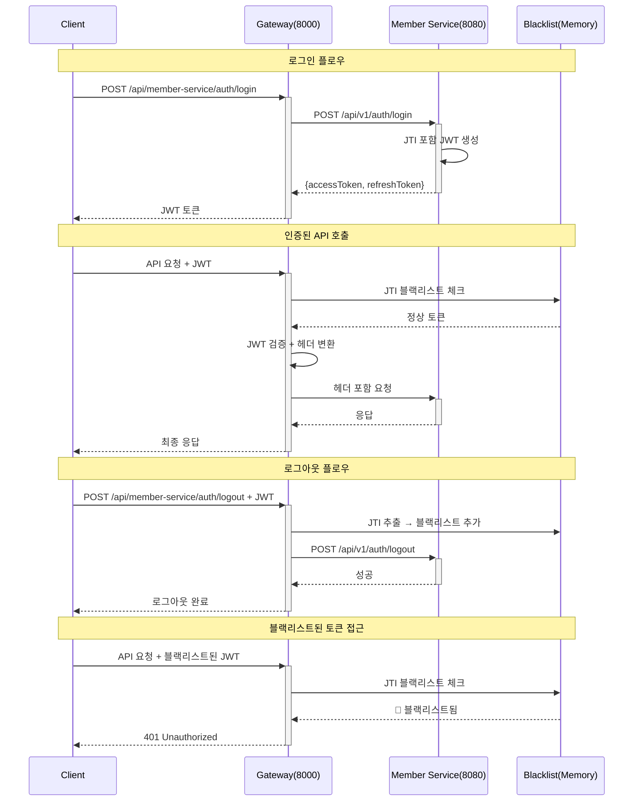

# JWT 인증 및 로그아웃 시스템 가이드

## 📋 개요

Gateway에서 JWT 기반 인증과 블랙리스트를 활용한 완전한 로그아웃 시스템 구현 가이드입니다.

**작성일**: 2025-01-18  
**버전**: 1.0.0  
**작성자**: Commerce 개발팀

---

## 🎯 시스템 아키텍처

### 전체 인증 플로우



---

## 🔧 주요 구성요소

### 1. JWT 토큰 구조 (JTI 포함)

```json
{
  "sub": "123456789",                           // 사용자 ID
  "email": "sw.noh@gmail.com",                  // 이메일
  "roles": "BUYER,SELLER",                      // 역할 (쉼표 구분)
  "type": "ACCESS",                             // 토큰 타입
  "jti": "a1b2c3d4-e5f6-7890-abcd-ef123456",   // ✅ JWT ID (고유 식별자)
  "iat": 1705520430,                            // 발급 시간
  "exp": 1705524030                             // 만료 시간
}
```

**JTI(JWT ID)의 중요성:**
- 개별 토큰의 고유 식별자
- 로그아웃 시 해당 토큰만 무효화 가능
- 블랙리스트 기능의 핵심

### 2. 블랙리스트 서비스 (Gateway)

```java
@Service
public class JwtBlacklistService {
    private final ConcurrentHashMap<String, LocalDateTime> blacklistTokens = new ConcurrentHashMap<>();
    
    // 토큰을 블랙리스트에 추가
    public void blacklistToken(String jti, Date expirationDate);
    
    // 토큰이 블랙리스트에 있는지 확인
    public boolean isBlacklisted(String jti);
    
    // 만료된 토큰 자동 정리 (1분마다)
    private void cleanupExpiredTokens();
}
```

**특징:**
- **메모리 기반**: Redis 없이 로컬 메모리 사용
- **자동 정리**: 만료된 토큰 주기적 삭제
- **Thread-Safe**: ConcurrentHashMap 사용

### 3. 인증 필터 (UserContextFilter)

```java
@Component
public class UserContextFilter implements GlobalFilter {
    
    // JWT 검증 + 블랙리스트 체크
    // 인증된 요청: 헤더 변환 후 전달
    // 블랙리스트된 토큰: 401 응답
    // 로그아웃 요청: JTI 블랙리스트 추가
}
```

**처리 과정:**
1. JWT 토큰에서 JTI 추출
2. 블랙리스트 확인
3. 정상 토큰: 헤더 변환 (`X-User-ID`, `X-EMAIL`, `X-ROLES`)
4. 블랙리스트된 토큰: 401 Unauthorized

---

## ⚙️ 설정 및 구성

### 1. Gateway 설정 (application.yml)

```yaml
# JWT 설정
jwt:
  secret: ${JWT_SECRET:mySecretKey123456789012345678901234567890123456789012345678901234567890}
  authority-claim: roles
  principal-claim: email

# 라우팅 설정
spring:
  cloud:
    gateway:
      routes:
        - id: member-service
          uri: http://localhost:8080
          predicates:
            - Path=/api/member-service/**
          filters:
            - RewritePath=/api/member-service/(?<segment>.*), /api/v1/$\{segment}

# CORS 설정
cors:
  allowed-origins: "http://localhost:3000,http://localhost:5173"
```

### 2. Member Service JWT 설정

```yaml
# JWT 설정 (Gateway와 동일한 secret 필요)
jwt:
  secret: ${JWT_SECRET:mySecretKey123456789012345678901234567890123456789012345678901234567890}
  access-token-expiry: ${JWT_ACCESS_TOKEN_EXPIRY:3600000}   # 1시간
  refresh-token-expiry: ${JWT_REFRESH_TOKEN_EXPIRY:604800000} # 7일
```

### 3. 보안 경로 설정

```java
// SecurityConfig.java
.authorizeExchange(ex ->
    ex
        // 화이트리스트 (인증 불필요)
        .pathMatchers(HttpMethod.POST, "/api/member-service/members").permitAll()
        .pathMatchers(
            "/api/member-service/auth/**",     // 로그인, 로그아웃
            "/actuator/**",                    // 헬스체크
            "/swagger-ui/**",                  // API 문서
            "/v3/api-docs/**"
        ).permitAll()
        
        // 인증 필요
        .pathMatchers("/api/member-service/members/**").hasAnyRole("BUYER", "SELLER", "ADMIN")
        .anyExchange().authenticated()
)
```

---

## 🧪 API 사용법

### 1. 로그인

**요청:**
```bash
POST http://localhost:8000/api/member-service/auth/login
Content-Type: application/json

{
  "email": "sw.noh@gmail.com",
  "password": "password123"
}
```

**응답:**
```json
{
  "accessToken": "eyJhbGciOiJIUzUxMiJ9.eyJzdWIiOiIxMjM0NTY3ODkwIiwiZW1haWwiOiJzdy5ub2hAZ21haWwuY29tIiwicm9sZXMiOiJCVVlFUiIsInR5cGUiOiJBQ0NFU1MiLCJqdGkiOiJhMWIyYzNkNC1lNWY2LTc4OTAtYWJjZC1lZjEyMzQ1Njc4OTAiLCJpYXQiOjE3MDU1MjA0MzAsImV4cCI6MTcwNTUyNDAzMH0.signature",
  "refreshToken": "eyJhbGciOiJIUzUxMiJ9...",
  "tokenType": "Bearer",
  "expiresIn": 3600000
}
```

### 2. 인증된 API 호출

**요청:**
```bash
GET http://localhost:8000/api/member-service/members/me
Authorization: Bearer YOUR_ACCESS_TOKEN
```

**Gateway 헤더 변환:**
```
X-User-ID: 123456789
X-EMAIL: sw.noh@gmail.com
X-ROLES: ROLE_BUYER,ROLE_SELLER
X-AUTH-METHOD: JWT
```

### 3. 로그아웃

**요청:**
```bash
POST http://localhost:8000/api/member-service/auth/logout
Authorization: Bearer YOUR_ACCESS_TOKEN
```

**응답:**
```
204 No Content
```

**내부 동작:**
1. JWT에서 JTI 추출
2. JTI를 블랙리스트에 추가
3. Member Service로 로그아웃 요청 전달

### 4. 블랙리스트된 토큰 접근

**요청:**
```bash
GET http://localhost:8000/api/member-service/members/me
Authorization: Bearer BLACKLISTED_TOKEN
```

**응답:**
```json
{
  "success": false,
  "code": "AUTH-401",
  "message": "로그아웃된 토큰입니다",
  "timestamp": 1705520430000
}
```

---

## 🔍 모니터링 및 로깅

### 1. 로그 패턴

```bash
# 토큰 생성 로그 (Member Service)
INFO  - 🔑 ACCESS Token 생성: JTI=a1b2c3d4, User=sw.noh@gmail.com, 만료=2025-01-18T15:00:30

# 블랙리스트 추가 로그 (Gateway)
INFO  - 토큰이 블랙리스트에 추가되었습니다. JTI: a1b2c3d4-e5f6-7890-abcd-ef123456

# 블랙리스트 차단 로그 (Gateway)
WARN  - 블랙리스트에 있는 토큰입니다. JTI: a1b2c3d4-e5f6-7890-abcd-ef123456

# 토큰 정리 로그 (Gateway)
INFO  - 만료된 블랙리스트 토큰 5개 제거 완료
```

### 2. 블랙리스트 통계 (선택사항)

```bash
# Actuator 엔드포인트
GET http://localhost:8000/actuator/jwt-blacklist

# 응답
{
  "totalCount": 15,
  "oldestExpiry": 1705520430,
  "newestExpiry": 1705527630
}
```

---

## 🚨 트러블슈팅

### 1. JWT Secret 불일치

**증상:**
```
JWT 토큰 검증 실패: 잘못된 JWT 서명입니다
```

**해결방법:**
Gateway와 Member Service의 `jwt.secret` 값이 동일한지 확인

```yaml
# 두 서비스 모두 동일해야 함
jwt:
  secret: ${JWT_SECRET:mySecretKey123456789012345678901234567890123456789012345678901234567890}
```

### 2. JTI 없는 토큰

**증상:**
```
⚠️ 토큰에 JTI가 없습니다: email=sw.noh@gmail.com
```

**해결방법:**
Member Service의 JwtTokenAdapter에서 JTI 생성 확인

```java
// 필수: UUID import 및 JTI 설정
import java.util.UUID;

.id(UUID.randomUUID().toString())  // JTI 추가
```

### 3. 블랙리스트 동작 안함

**증상:**
로그아웃 후에도 토큰이 계속 유효함

**체크포인트:**
1. Gateway의 JwtBlacklistService Bean 등록 확인
2. UserContextFilter에서 블랙리스트 서비스 주입 확인
3. 토큰에 JTI 포함 여부 확인

### 4. CORS 에러

**증상:**
```
Access to fetch at 'http://localhost:8000' has been blocked by CORS policy
```

**해결방법:**
```yaml
cors:
  allowed-origins: "http://localhost:3000,http://localhost:5173"
```

### 5. 라우팅 실패

**증상:**
```
404 Not Found - No matching route found
```

**해결방법:**
URL 패턴 확인
- `POST /api/member-service/auth/login` → `POST /api/v1/auth/login`
- Member Service가 `server.servlet.context-path: /api/v1` 설정 확인

---

## 📈 성능 고려사항

### 1. 메모리 사용량

**블랙리스트 크기 예상:**
- 1일 1000명 로그아웃 = 1000개 엔트리
- 1개 엔트리 = 약 100바이트 (JTI 36자 + 메타데이터)
- 1일 약 100KB 메모리 사용

**최적화 방안:**
- 만료된 토큰 자동 정리 (1분마다)
- 필요시 LRU 캐시 적용

### 2. 다중 인스턴스 환경

**현재 한계:**
- Gateway 재시작 시 블랙리스트 소실
- 여러 Gateway 인스턴스 간 동기화 안됨

**개선 방안:**
- Redis 기반 블랙리스트로 전환
- 파일 백업 기능 추가
- Gateway 간 동기화 API 구현

---

## 🎯 결론

### ✅ 완성된 기능

1. **완전한 로그아웃**: JTI 기반 개별 토큰 무효화
2. **보안 강화**: 블랙리스트된 토큰 즉시 차단
3. **메모리 효율**: Redis 없이 로컬 메모리 활용
4. **자동 정리**: 만료된 토큰 주기적 삭제
5. **확장성**: MSA 환경에 최적화

### ⚡ 주요 장점

- **의존성 최소화**: Redis 불필요
- **빠른 응답**: 메모리 기반 조회
- **운영 편의성**: 별도 인프라 불필요
- **테스트 용이성**: 단순한 구조

### 🔄 향후 개선사항

1. **Redis 연동**: 프로덕션 환경 고려
2. **클러스터 지원**: 다중 Gateway 동기화
3. **모니터링 강화**: 메트릭 및 알림
4. **토큰 순환**: Refresh Token 자동 갱신

**이제 완전한 JWT 인증 시스템이 준비되었습니다!** 🚀
