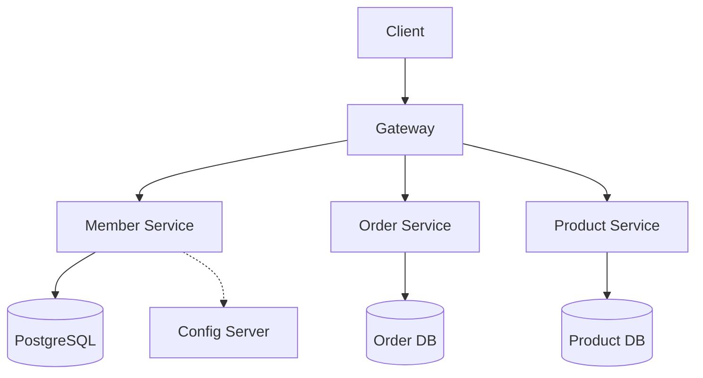
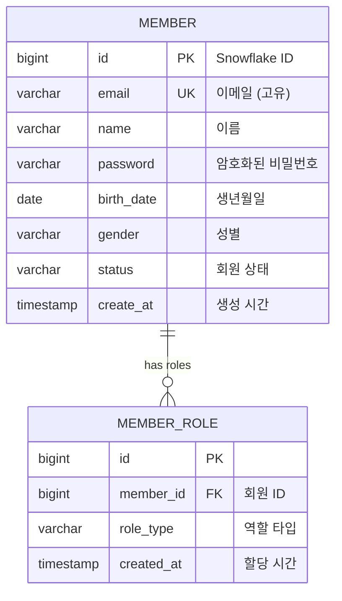

# 👥 Member Service

Commerce MSA 플랫폼의 **회원 관리 및 인증** 마이크로서비스입니다.


---

## 📋 목차

- [개요](#-개요)
- [아키텍처](#-아키텍처)
- [주요 기능](#-주요-기능)
  - [회원 관리](#1-회원-관리)
  - [인증 시스템](#2-인증-시스템)
- [API 가이드](#-api-가이드)
- [개발 환경 설정](#-개발-환경-설정)
- [데이터베이스](#-데이터베이스)
- [보안](#-보안)
- [테스트](#-테스트)
- [모니터링](#-모니터링)
- [문서](#-관련-문서)

---

## 🎯 개요

### 책임과 역할

**Member Service**는 Commerce 플랫폼에서 다음과 같은 핵심 책임을 담당합니다:

- 👤 **회원 관리**: 사용자 등록, 프로필 관리, 상태 관리
- 🔐 **인증**: JWT 기반 로그인/로그아웃, 토큰 관리
- 🛡️ **권한 관리**: 역할 기반 접근 제어 (RBAC)
- 🔒 **보안**: 비밀번호 암호화, 토큰 검증

### 기술 스택

| 영역 | 기술 | 버전 | 용도 |
|------|------|------|------|
| **Framework** | Spring Boot | 3.5.3 | 애플리케이션 프레임워크 |
| **Security** | Spring Security + JWT | 6.x + 0.12.3 | 인증/인가 |
| **Database** | PostgreSQL | 16 | 운영 데이터베이스 |
| **ORM** | Spring Data JPA | 3.x | 데이터 접근 계층 |
| **Password** | BCrypt | 0.10.2 | 비밀번호 암호화 |
| **ID Generation** | Snowflake | Custom | 분산 ID 생성 |
| **Config** | Spring Cloud Config | 4.x | 외부 설정 관리 |

---

## 🏗️ 아키텍처

### 헥사고날 아키텍처 (Ports & Adapters)

```
┌─────────────────────────────────────────────────────────────┐
│                    Member Service                           │
├─────────────────────────────────────────────────────────────┤
│  Infrastructure Layer (Adapters)                            │
│  ├── in/  : AuthController, MemberController                │
│  ├── out/ : JpaRepository, JwtTokenAdapter, BCryptAdapter   │
│  └── persistence/ : MemberJpaRepository                     │
├─────────────────────────────────────────────────────────────┤
│  Application Layer (Use Cases)                              │
│  ├── service/ : AuthApplicationService, MemberService       │
│  ├── port/in/  : AuthUseCase, MemberUseCase                 │
│  └── port/out/ : MemberRepository, TokenPort                │
├─────────────────────────────────────────────────────────────┤
│  Domain Layer (Business Logic)                              │
│  ├── member/ : Member, Email, MemberRole, MemberStatus      │
│  ├── auth/   : JwtTokenInfo, LoginRequest, UserAuthInfo     │
│  └── validation/ : 도메인 검증 규칙                             │ 
└─────────────────────────────────────────────────────────────┘
```

### MSA 내에서의 위치



---

## 🔧 주요 기능

### 1. 회원 관리

#### 1.1 회원 가입 📝

**기능**: 새로운 사용자 등록 및 기본 역할 할당

**비즈니스 규칙**:
- 이메일 중복 불가
- 비밀번호 BCrypt 암호화
- 기본적으로 `BUYER` 역할 할당
- Snowflake ID로 고유 식별자 생성

**구현 예시**:
```java
@PostMapping("/members")
public ResponseEntity<MemberResponse> createMember(@RequestBody MemberCreateRequest request) {
    MemberResponse member = memberUseCase.createMember(request);
    return ResponseEntity.status(HttpStatus.CREATED).body(member);
}
```

**도메인 로직**:
```java
public static Member create(String email, String name, String password, String birthDate, String gender) {
    Member member = new Member();
    member.email = new Email(email);           // 이메일 유효성 검증
    member.setName(name);                      // 이름 검증
    member.setPassword(password);              // 비밀번호 정책 검증
    member.status = MemberStatus.ACTIVE;       // 기본 활성화
    member.assignBuyerRole();                  // BUYER 역할 할당
    return member;
}
```

#### 1.2 회원 조회 👀

**기능**: 회원 정보 조회 (본인/관리자만 가능)

**권한 제어**:
```java
@GetMapping("/{memberId}")
public ResponseEntity<MemberResponse> getMember(
        @PathVariable Long memberId,
        @CurrentUser AuthenticatedUser currentUser) {
    
    // 권한 체크: 본인 또는 관리자만
    if (!currentUser.canAccess(memberId)) {
        throw new ForbiddenException("권한이 없습니다.");
    }
    
    return ResponseEntity.ok(memberUseCase.getMember(memberId));
}
```

#### 1.3 프로필 관리 ✏️

**기능**: 회원 정보 수정, 상태 변경

**지원하는 정보**:
- 기본 정보: 이름, 생년월일, 성별
- 상태 관리: ACTIVE, INACTIVE, SUSPENDED
- 역할 관리: BUYER, SELLER, ADMIN

### 2. 인증 시스템

#### 2.1 JWT 기반 로그인 🔐

**기능**: 이메일/비밀번호 인증 후 JWT 토큰 발급

**토큰 구조**:
```json
{
  "sub": "2158078162337996800",    // 사용자 ID (Snowflake)
  "email": "user@example.com",     // 이메일
  "roles": "BUYER,SELLER",         // 역할 (쉼표 구분)
  "type": "ACCESS",                // 토큰 타입
  "iat": 1705520430,               // 발급 시간
  "exp": 1705524030                // 만료 시간 (1시간)
}
```

**로그인 플로우**:
```java
@PostMapping("/auth/login")
public ResponseEntity<LoginResponse> login(@RequestBody LoginRequest request) {
    // 1. 사용자 인증
    UserAuthInfo userAuthInfo = userAuthInfoProvider.findByEmail(request.email());
    
    // 2. 비밀번호 검증
    if (!passwordEncoder.matches(request.password(), userAuthInfo.password())) {
        throw new IllegalArgumentException("비밀번호가 일치하지 않습니다.");
    }
    
    // 3. JWT 토큰 생성
    String accessToken = tokenPort.generateAccessToken(
        userAuthInfo.userId(), 
        userAuthInfo.email(), 
        userAuthInfo.roleNames()
    );
    
    return ResponseEntity.ok(new LoginResponse(accessToken, refreshToken));
}
```

#### 2.2 권한 기반 접근 제어 🛡️

**역할 체계**:
```java
public enum RoleType {
    BUYER("구매자"),      // 기본 사용자
    SELLER("판매자"),     // 상품 판매자
    ADMIN("관리자");      // 시스템 관리자
}
```

**권한 매트릭스**:

| 기능 | BUYER | SELLER | ADMIN |
|------|-------|--------|-------|
| 회원가입 | ✅ | ✅ | ✅ |
| 내 정보 조회 | ✅ | ✅ | ✅ |
| 다른 회원 조회 | ❌ | ❌ | ✅ |
| 회원 상태 변경 | ❌ | ❌ | ✅ |
| 상품 등록 | ❌ | ✅ | ✅ |

#### 2.3 Gateway 연동 🌐

**헤더 기반 사용자 정보 전달**:

```bash
# Gateway → Member Service
GET /api/v1/members/123
X-User-ID: 2158078162337996800
X-EMAIL: user@example.com
X-ROLES: ROLE_BUYER,ROLE_SELLER
X-AUTH-METHOD: JWT
```

**ArgumentResolver를 통한 사용자 정보 추출**:
```java
@GetMapping("/{memberId}")
public ResponseEntity<MemberResponse> getMember(
        @PathVariable Long memberId,
        @CurrentUser AuthenticatedUser currentUser) {
    // Gateway에서 전달된 헤더 정보를 자동으로 AuthenticatedUser 객체로 변환
    return ResponseEntity.ok(memberUseCase.getMember(memberId));
}
```

---

## 📡 API 가이드

### 인증 API

#### 로그인
```http
POST /auth/login
Content-Type: application/json

{
  "email": "user@example.com",
  "password": "password123"
}
```

**응답**:
```json
{
  "accessToken": "eyJhbGciOiJIUzUxMiJ9...",
  "refreshToken": "eyJhbGciOiJIUzUxMiJ9...",
  "tokenType": "Bearer",
  "expiresIn": 3600
}
```

#### 로그아웃
```http
POST /auth/logout
Authorization: Bearer {accessToken}
```

### 회원 관리 API

#### 회원 가입
```http
POST /members
Content-Type: application/json

{
  "email": "newuser@example.com",
  "name": "홍길동",
  "password": "password123",
  "birthDate": "1990-01-01",
  "gender": "MALE"
}
```

#### 내 정보 조회
```http
GET /members/me
Authorization: Bearer {accessToken}
```

#### 특정 회원 조회
```http
GET /members/{memberId}
Authorization: Bearer {accessToken}
```

### 응답 형식

**성공 응답**:
```json
{
  "memberId": 2158078162337996800,
  "email": "user@example.com",
  "name": "홍길동",
  "birthDate": "1990-01-01",
  "gender": "MALE",
  "status": "ACTIVE",
  "createdAt": "2025-01-18T10:30:00",
  "roles": ["BUYER"]
}
```

**에러 응답**:
```json
{
  "success": false,
  "code": "MEMBER-001",
  "message": "회원을 찾을 수 없습니다.",
  "timestamp": 1705520430000,
  "traceId": "abc123..."
}
```

---

## 🚀 개발 환경 설정

### 사전 요구 사항

- **Java 21** 이상
- **PostgreSQL 16** (운영) / **H2** (테스트)
- **Spring Boot 3.5.3**

### 로컬 실행

#### 1. 환경 변수 설정

```bash
# 필수 환경 변수
export JWT_SECRET="your-super-secret-key-at-least-512-bits-long"
export db_url="jdbc:postgresql://localhost:5432/commerce_member"
export db_username="commerce_user"
export db_password="your_password"
export JASYPT_ENCRYPTOR_PASSWORD="encryption_key"
```

#### 2. 데이터베이스 실행

```bash
# PostgreSQL 실행 (Docker)
docker run -d \
  --name postgres-member \
  -e POSTGRES_DB=commerce_member \
  -e POSTGRES_USER=commerce_user \
  -e POSTGRES_PASSWORD=your_password \
  -p 5432:5432 \
  postgres:16
```

#### 3. 애플리케이션 실행

```bash
# 프로젝트 루트에서
cd service/member
./gradlew bootRun
```

#### 4. Health Check

```bash
curl http://localhost:8080/api/v1/auth/health
# 응답: "인증 서버가 정상 작동 중입니다."
```

### IDE 설정

#### IntelliJ IDEA
1. **Project Structure** → **SDK**: Java 21
2. **Gradle** → **Build and run using**: Gradle
3. **Annotation Processing** 활성화 (Lombok)

#### VS Code
```json
// .vscode/settings.json
{
  "java.configuration.updateBuildConfiguration": "automatic",
  "java.compile.nullAnalysis.mode": "automatic"
}
```

---

## 🗄️ 데이터베이스

### ERD (Entity Relationship Diagram)



### 테이블 상세

#### MEMBER 테이블
```sql
CREATE TABLE member (
    id            BIGINT       PRIMARY KEY,           -- Snowflake ID
    email         VARCHAR(255) NOT NULL UNIQUE,      -- 이메일
    name          VARCHAR(100) NOT NULL,             -- 이름
    password      VARCHAR(255) NOT NULL,             -- BCrypt 해시
    birth_date    DATE,                               -- 생년월일
    gender        VARCHAR(10)  NOT NULL,             -- MALE/FEMALE
    status        VARCHAR(20)  NOT NULL DEFAULT 'ACTIVE', -- 회원 상태
    create_at     TIMESTAMP    NOT NULL DEFAULT NOW() -- 생성 시간
);
```

#### MEMBER_ROLE 테이블
```sql
CREATE TABLE member_role (
    id          BIGINT      PRIMARY KEY,
    member_id   BIGINT      NOT NULL,
    role_type   VARCHAR(50) NOT NULL,              -- BUYER/SELLER/ADMIN
    created_at  TIMESTAMP   NOT NULL DEFAULT NOW(),
    
    FOREIGN KEY (member_id) REFERENCES member(id)
);
```

### 테스트 데이터

```bash
# 테스트 데이터 삽입
psql -d commerce_member -f service/member/insert-test-data.sql
```

---

## 🛡️ 보안

### 비밀번호 보안

**BCrypt 암호화**:
```java
@Component
public class BCryptPasswordEncoderAdapter implements PasswordEncoderPort {
    
    private static final int STRENGTH = 12;  // 보안 강도
    private final BCrypt.Hasher hasher = BCrypt.withDefaults();
    
    @Override
    public String encode(String rawPassword) {
        validatePasswordPolicy(rawPassword);  // 정책 검증
        return hasher.hashToString(STRENGTH, rawPassword.toCharArray());
    }
}
```

**비밀번호 정책**:
- 최소 8자 이상
- 영문, 숫자, 특수문자 포함
- 연속된 문자 금지

### JWT 보안

**토큰 설정**:
```yaml
jwt:
  secret: ${JWT_SECRET}                    # 512비트 이상 시크릿
  access-token-expiry: 3600000            # 1시간
  refresh-token-expiry: 604800000         # 7일
```

**보안 헤더**:
```java
return ResponseEntity.ok()
    .header("X-Content-Type-Options", "nosniff")
    .header("X-Frame-Options", "DENY")
    .header("Cache-Control", "no-store, no-cache, must-revalidate")
    .body(loginResponse);
```

### 권한 검증

**메서드 레벨 보안**:
```java
@PreAuthorize("hasRole('ADMIN') or #memberId == authentication.principal.userId")
public MemberResponse getMember(Long memberId) {
    // 관리자이거나 본인만 접근 가능
}
```

---

## 🧪 테스트

### 테스트 구조

```
src/test/java/
├── application/          # 애플리케이션 서비스 테스트
├── domain/              # 도메인 모델 테스트
├── infrastructure/      # 어댑터 테스트
└── integration/         # 통합 테스트
```

### 단위 테스트

#### 도메인 테스트
```java
@Test
void 회원_생성_성공() {
    // Given
    String email = "test@example.com";
    String name = "홍길동";
    
    // When
    Member member = Member.create(email, name, "password", "1990-01-01", "MALE");
    
    // Then
    assertThat(member.getEmail().email()).isEqualTo(email);
    assertThat(member.getName()).isEqualTo(name);
    assertThat(member.getStatus()).isEqualTo(MemberStatus.ACTIVE);
}
```

#### 서비스 테스트
```java
@ExtendWith(MockitoExtension.class)
class MemberApplicationServiceTest {
    
    @Mock private MemberRepository memberRepository;
    @Mock private PasswordEncoderPort passwordEncoder;
    
    @Test
    void 회원가입_성공() {
        // Given
        MemberCreateRequest request = new MemberCreateRequest(
            "test@example.com", "홍길동", "password", "1990-01-01", "MALE"
        );
        
        // When & Then
        assertThatNoException().isThrownBy(() -> {
            memberService.createMember(request);
        });
    }
}
```

### 통합 테스트

#### 컨트롤러 테스트
```java
@WebMvcTest(MemberController.class)
@AutoConfigureMockMvc
@Import(SecurityConfig.class)  // 필수!
class MemberControllerTest {

    @Test
    void 회원조회_성공() throws Exception {
        mockMvc.perform(get("/members/1")
                        .header("X-User-ID", "1")
                        .header("X-EMAIL", "test@test.com")
                        .header("X-ROLES", "BUYER"))
                .andExpect(status().isOk());
    }
}
```

### 테스트 실행

```bash
# 전체 테스트
./gradlew test

# 특정 테스트 클래스
./gradlew test --tests MemberControllerTest

# 테스트 커버리지
./gradlew jacocoTestReport
```

---

## 📊 모니터링

### Health Check

```bash
# 기본 헬스 체크
curl http://localhost:8080/api/v1/auth/health

# Actuator 엔드포인트
curl http://localhost:8080/actuator/health
```

### 로깅

**로그 레벨 설정**:
```yaml
logging:
  level:
    innercircle.member: DEBUG
    org.springframework.security: DEBUG
  pattern:
    level: "%5p [${spring.application.name},%X{traceId:-},%X{spanId:-}]"
```

**주요 로그 포인트**:
```java
// 인증 성공/실패
log.info("로그인 성공 - 사용자: {} ({})", email, userId);
log.warn("로그인 실패 - 이메일: {}, 원인: {}", email, reason);

// 권한 체크
log.warn("권한 부족 - 사용자: {}, 요청: {}", userId, endpoint);

// 회원 상태 변경
log.info("회원 상태 변경 - ID: {}, {} → {}", memberId, oldStatus, newStatus);
```

### 메트릭스

**커스텀 메트릭스**:
```java
@Component
public class MemberMetrics {
    
    @EventListener
    public void onMemberCreated(MemberCreatedEvent event) {
        Metrics.counter("member.created", "role", event.getRole()).increment();
    }
    
    @EventListener  
    public void onLoginAttempt(LoginAttemptEvent event) {
        Metrics.counter("auth.login.attempt", 
            "result", event.isSuccess() ? "success" : "failure"
        ).increment();
    }
}
```

---

## 📚 관련 문서

### 아키텍처 & 설계
- 📖 [Member Domain 설계](docs/member-domain-design.md) - 도메인 모델 상세 설계
- 🏗️ [Service Discovery 비교](docs/service-discovery-comparison.md) - MSA 아키텍처 가이드

### 인증 & 보안
- 🔐 [JWT 구현 가이드](docs/JWT_IMPLEMENTATION_GUIDE.md) - JWT 인증 시스템 전체 구현 가이드
- 🛡️ [JWT 보안 가이드](docs/JWT_SECURITY_GUIDE.md) - 보안 위협과 방어 전략
- 🔄 [Refresh Token 가이드](docs/REFRESH_TOKEN_GUIDE.md) - 토큰 갱신 시스템 구현 및 사용법
- 🔒 [JWT-Redis 인증](docs/jwt-redis-authentication.md) - Redis 기반 토큰 관리

### 인프라 & 설정
- 🐘 [PostgreSQL 설정](docs/postgresql-setup.md) - 데이터베이스 설정 가이드

---

## 🤝 기여 가이드

### 코딩 컨벤션

**패키지 구조**:
```
innercircle.member
├── application/     # 애플리케이션 레이어
├── domain/         # 도메인 레이어
└── infrastructure/ # 인프라스트럭처 레이어
```

**네이밍 컨벤션**:
- **클래스**: PascalCase (예: `MemberApplicationService`)
- **메서드**: camelCase (예: `createMember`)
- **상수**: UPPER_SNAKE_CASE (예: `DEFAULT_ROLE`)

### Git 워크플로우

```bash
# Feature 브랜치 생성
git checkout -b feature/member-profile-update

# 커밋 메시지 규칙
git commit -m "feat: 회원 프로필 수정 기능 추가"
git commit -m "fix: 비밀번호 검증 오류 수정"
git commit -m "docs: API 가이드 업데이트"
```

### Pull Request

1. **기능 단위로 작은 PR** 생성
2. **테스트 코드** 포함 필수
3. **문서 업데이트** (API 변경 시)
4. **리뷰 요청** 전 자체 테스트 완료

---

## 🐛 트러블슈팅

### 자주 발생하는 문제

#### 1. JWT 토큰 검증 실패
```bash
# 증상
"Failed to validate the token"

# 원인
- Gateway와 Member Service의 JWT Secret 불일치
- 토큰 만료
- 알고리즘 불일치 (HS256 vs HS512)

# 해결책
1. JWT_SECRET 환경변수 확인
2. 토큰 만료시간 확인  
3. 알고리즘 통일 (HS512 권장)
```

#### 2. 403 Forbidden 에러
```bash
# 증상
테스트에서 403 에러 발생

# 원인
@WebMvcTest에 SecurityConfig import 누락

# 해결책
@Import(SecurityConfig.class) 추가
```

#### 3. 데이터베이스 연결 실패
```bash
# 증상
Connection refused to PostgreSQL

# 해결책
1. PostgreSQL 서버 실행 확인
2. 환경변수 설정 확인
3. 방화벽 설정 확인
```

### 로그 분석

**디버그 모드 활성화**:
```yaml
logging:
  level:
    innercircle.member: DEBUG
    org.springframework.security: DEBUG
    org.springframework.web: DEBUG
```

---

### 개발팀 연락처
- **Team Lead**: Commerce 개발팀
- **Repository**: [GitHub - Commerce Platform](https://github.com/INNER-CIRCLE-ICD4/Project-3.-Commerce)
- **Issues**: GitHub Issues 활용

### 긴급 상황
- **Production Issue**: Slack #commerce-alerts
- **Security Issue**: 보안팀 직접 연락

---

**Last Updated**: 2025-08-18  
**Version**: 1.0.0  
**Maintainer**: Commerce 개발팀
