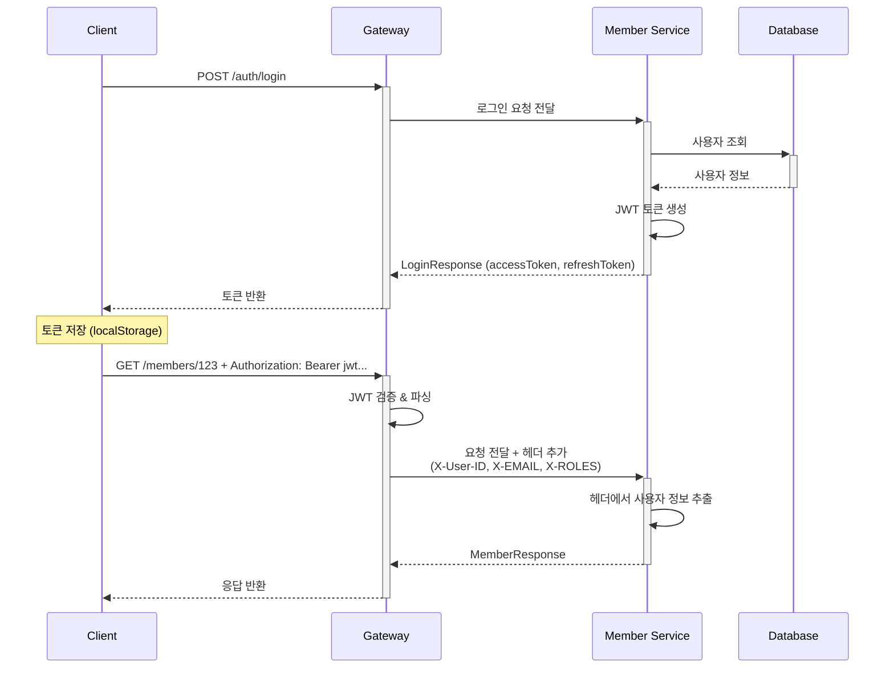

# JWT 인증 시스템 구현 가이드

## 📋 개요

Commerce MSA 프로젝트에서 JWT 기반 인증 시스템을 구축한 내용을 정리한 구현 가이드입니다.

**작성일**: 2025-01-18

**버전**: 1.0.0

**작성자**: 커머스 개발팀

---

## 🎯 JWT를 선택한 이유

### 1. **MSA 아키텍처와의 적합성**

```
Client → Gateway → Member Service
              ↘ → Order Service
              ↘ → Product Service
              ↘ → Review Service

```

**기존 세션 방식의 문제점:**

- ❌ 각 서비스마다 세션 스토어 필요
- ❌ 세션 동기화 복잡성
- ❌ 수평 확장 시 세션 공유 문제

**JWT의 장점:**

- ✅ **무상태(Stateless)**: 서버에 상태 저장 불필요
- ✅ **서비스 간 독립성**: 각 서비스가 독립적으로 토큰 검증
- ✅ **확장성**: 토큰에 필요한 정보 포함
- ✅ **표준화**: RFC 7519 표준 준수

### 2. **Gateway 중심 인증의 효율성**

```bash
# JWT 방식 (현재 구현)
1. Client → Gateway: JWT 토큰 전송
2. Gateway: JWT 검증 + 사용자 정보 추출
3. Gateway → Backend: 헤더로 사용자 정보 전달 (X-User-ID, X-EMAIL, X-ROLES)
4. Backend: 헤더 정보 활용 (재검증 불필요)

```

**효율성:**

- ✅ **한 번만 검증**: Gateway에서만 JWT 파싱
- ✅ **성능 향상**: Backend에서 토큰 재검증 불필요
- ✅ **네트워크 최적화**: 헤더는 토큰보다 가벼움

### 3. **보안과 편의성의 균형**

```java
// Access Token: 짧은 만료시간 (1시간)
"exp": 1705520430  // 보안 강화

// Refresh Token: 긴 만료시간 (7일)
"exp": 1706125230  // 사용자 편의성

```

---

## 🏗️ 시스템 아키텍처

### 전체 인증 플로우



---

## 🛠️ 핵심 구현 사항

### 1. JWT 토큰 생성 및 검증

### **JwtTokenAdapter 구현**

```java
@Component
public class JwtTokenAdapter implements TokenPort {

    private final SecretKey secretKey;
    private final long accessTokenExpiry;
    private final long refreshTokenExpiry;

    @Override
    public String generateAccessToken(Long userId, String email, List<String> roles) {
        return generateToken(userId, email, roles, TokenType.ACCESS, accessTokenExpiry);
    }

    private String generateToken(Long userId, String email, List<String> roles,
                               TokenType tokenType, long expiry) {
        Date now = new Date();
        Date expiryDate = new Date(now.getTime() + expiry);

        return Jwts.builder()
                .subject(userId.toString())           // 사용자 ID
                .claim("email", email)               // 이메일
                .claim("roles", String.join(",", roles))  // 역할 (쉼표 구분)
                .claim("type", tokenType.name())     // 토큰 타입
                .issuedAt(now)                       // 발급 시간
                .expiration(expiryDate)              // 만료 시간
                .signWith(secretKey)                 // HS512 서명
                .compact();
    }
}

```

**토큰 구조:**

```json
{
  "sub": "2158078162337996800",    // 사용자 ID
  "email": "sw.noh@gmail.com",     // 이메일
  "roles": "BUYER",                // 역할 (쉼표 구분)
  "type": "ACCESS",                // 토큰 타입
  "iat": 1705520430,               // 발급 시간
  "exp": 1705524030                // 만료 시간
}

```

### 2. Gateway JWT 검증 및 헤더 변환

### **SecurityConfig 설정**

```java
@Configuration
@EnableWebFluxSecurity
public class SecurityConfig {

    @Bean
    SecurityWebFilterChain springSecurityFilterChain(ServerHttpSecurity http, ReactiveJwtDecoder jwtDecoder) {

        JwtGrantedAuthoritiesConverter gac = new JwtGrantedAuthoritiesConverter();
        gac.setAuthoritiesClaimName("roles");     // JWT의 roles 클레임 사용
        gac.setAuthorityPrefix("ROLE_");          // Spring Security 규칙

        JwtAuthenticationConverter delegate = new JwtAuthenticationConverter();
        delegate.setJwtGrantedAuthoritiesConverter(gac);

        return http
                .csrf(ServerHttpSecurity.CsrfSpec::disable)
                .authorizeExchange(ex ->
                        ex.pathMatchers("/api/member-service/auth/**").permitAll()  // 로그인 허용
                          .pathMatchers(HttpMethod.POST, "/api/member-service/members").permitAll()  // 회원가입 허용
                          .pathMatchers("/api/member-service/members/**").hasAnyRole("BUYER", "SELLER", "ADMIN")  // 인증 필요
                          .anyExchange().authenticated()
                )
                .oauth2ResourceServer(oauth2 -> oauth2
                        .jwt(jwt -> jwt
                                .jwtDecoder(jwtDecoder)
                                .jwtAuthenticationConverter(new ReactiveJwtAuthenticationConverterAdapter(delegate))
                        )
                )
                .build();
    }

    @Bean
    ReactiveJwtDecoder jwtDecoder(@Value("${jwt.secret}") String secret) {
        SecretKey key = new SecretKeySpec(secret.getBytes(StandardCharsets.UTF_8), "HmacSHA512");

        return NimbusReactiveJwtDecoder.withSecretKey(key)
                .macAlgorithm(MacAlgorithm.HS512)  // Member Service와 동일한 알고리즘
                .build();
    }
}

```

### **UserContextFilter - JWT → 헤더 변환**

```java
@Component
public class UserContextFilter implements GlobalFilter, Ordered {

    @Override
    public Mono<Void> filter(ServerWebExchange exchange, GatewayFilterChain chain) {
        return ReactiveSecurityContextHolder.getContext()
                .map(SecurityContext::getAuthentication)
                .filter(Authentication::isAuthenticated)
                .cast(Authentication.class)
                .map(auth -> {
                    if (auth instanceof JwtAuthenticationToken token) {
                        String userId = token.getToken().getSubject();
                        String email = token.getToken().getClaimAsString("email");
                        String roles = auth.getAuthorities().stream()
                                .map(GrantedAuthority::getAuthority)
                                .collect(Collectors.joining(","));

                        ServerHttpRequest mutated = exchange.getRequest().mutate()
                                .headers(h -> {
                                    h.set("X-User-ID", userId);      // 사용자 ID
                                    h.set("X-EMAIL", email);         // 이메일
                                    h.set("X-ROLES", roles);         // 권한들
                                    h.set("X-AUTH-METHOD", "JWT");   // 인증 방식
                                })
                                .build();
                        return exchange.mutate().request(mutated).build();
                    }
                    return exchange;
                })
                .defaultIfEmpty(exchange)
                .flatMap(chain::filter);
    }
}

```

**헤더 변환 결과:**

```
# Gateway → Member Service 요청
GET /api/v1/members/123 HTTP/1.1
X-User-ID: 2158078162337996800
X-EMAIL: sw.noh@gmail.com
X-ROLES: ROLE_BUYER,ROLE_SELLER
X-AUTH-METHOD: JWT

```

### 3. Member Service에서 사용자 정보 활용

### **@CurrentUser ArgumentResolver 방식 (최종 선택) - TODO**

```java
// 1. 사용자 정보 DTO
public record AuthenticatedUser(
    Long userId,
    String email,
    List<String> roles
) {
    public boolean hasRole(String role) {
        return roles != null && roles.contains(role);
    }

    public boolean isAdmin() {
        return hasRole("ADMIN");
    }

    public boolean canAccess(Long targetUserId) {
        return isAdmin() || userId.equals(targetUserId);
    }
}

// 2. 커스텀 어노테이션
@Target(ElementType.PARAMETER)
@Retention(RetentionPolicy.RUNTIME)
public @interface CurrentUser {
}

// 3. ArgumentResolver 구현
@Component
public class GatewayUserArgumentResolver implements HandlerMethodArgumentResolver {

    @Override
    public boolean supportsParameter(MethodParameter parameter) {
        return parameter.hasParameterAnnotation(CurrentUser.class) &&
               AuthenticatedUser.class.isAssignableFrom(parameter.getParameterType());
    }

    @Override
    public Object resolveArgument(MethodParameter parameter,
                                ModelAndViewContainer mavContainer,
                                NativeWebRequest webRequest,
                                WebDataBinderFactory binderFactory) {

        String userIdStr = webRequest.getHeader("X-User-ID");
        String email = webRequest.getHeader("X-EMAIL");
        String rolesStr = webRequest.getHeader("X-ROLES");

        if (!StringUtils.hasText(userIdStr)) {
            throw new UnauthorizedException("인증 정보가 없습니다.");
        }

        Long userId = Long.valueOf(userIdStr);
        List<String> roles = parseRoles(rolesStr);

        return new AuthenticatedUser(userId, email, roles);
    }

    private List<String> parseRoles(String rolesStr) {
        if (!StringUtils.hasText(rolesStr)) {
            return List.of("BUYER");
        }

        return Arrays.stream(rolesStr.split(","))
                .map(String::trim)
                .map(role -> role.startsWith("ROLE_") ? role.substring(5) : role)
                .toList();
    }
}

```

### **컨트롤러에서 사용**

```java
@RestController
@RequestMapping("/members")
@RequiredArgsConstructor
public class MemberController {

    @GetMapping("/{memberId}")
    public ResponseEntity<MemberResponse> getMember(
            @PathVariable Long memberId,
            @CurrentUser AuthenticatedUser currentUser) {  // ✅ 깔끔한 사용!

        log.info("회원 조회 요청 - 대상: {}, 요청자: {} ({})",
                memberId, currentUser.email(), currentUser.userId());

        // 권한 체크
        if (!currentUser.canAccess(memberId)) {
            throw new ForbiddenException("본인의 정보만 조회할 수 있습니다.");
        }

        MemberResponse member = memberUseCase.getMember(memberId);
        return ResponseEntity.ok(member);
    }

    @GetMapping("/me")
    public ResponseEntity<MemberResponse> getMyInfo(@CurrentUser AuthenticatedUser currentUser) {
        return ResponseEntity.ok(memberUseCase.getMember(currentUser.userId()));
    }
}

```

---

## 🧪 테스트 전략

### 1. 단위 테스트 - SecurityConfig 적용 필요

```java
@WebMvcTest(MemberController.class)
@AutoConfigureMockMvc
@Import(SecurityConfig.class)  // ✅ SecurityConfig 반드시 import 필요!
class MemberControllerTest {

    @MockBean
    private MemberUseCase memberUseCase;

    @Test
    void 회원조회_성공() throws Exception {
        // Given
        AuthenticatedUser user = new AuthenticatedUser(1L, "test@test.com", List.of("BUYER"));

        // When & Then
        mockMvc.perform(get("/members/1")
                        .header("X-User-ID", "1")
                        .header("X-EMAIL", "test@test.com")
                        .header("X-ROLES", "BUYER"))
                .andExpect(status().isOk());
    }
}

```

**주요 포인트:**

- ✅ `@Import(SecurityConfig.class)` 필수
- ✅ 테스트용 헤더 직접 설정
- ✅ MockBean을 통한 의존성 Mock

### 2. 통합 테스트 - 실제 JWT 토큰 사용

```
### 1. 로그인
POST <http://localhost:8000/api/member-service/auth/login>
Content-Type: application/json

{
  "email": "sw.noh@gmail.com",
  "password": "password1234"
}

> 

### 2. 인증이 필요한 API 호출
GET <http://localhost:8000/api/member-service/members/{{userId}>}
Authorization: {{tokenType}} {{accessToken}}

```

---

## 🚨 JWT 로그아웃 문제와 해결 방안

### 문제: JWT의 무상태성

```bash
# 전통적인 세션 방식
로그아웃 → 서버에서 세션 삭제 → 즉시 무효화 ✅

# JWT 방식
로그아웃 → ??? → 토큰은 여전히 유효함 ❌

```

### 해결 방안 1: 클라이언트 사이드 로그아웃

```java
@PostMapping("/logout")
public ResponseEntity<Map<String, Object>> logout() {
    Map<String, Object> response = Map.of(
        "success", true,
        "message", "로그아웃되었습니다. 토큰을 삭제해주세요.",
        "action", "CLEAR_TOKENS"
    );

    return ResponseEntity.ok(response);
}

```

**장점**: 구현 간단, 성능 좋음

**단점**: 토큰 탈취 시 여전히 사용 가능

### 해결 방안 2: 블랙리스트 방식 (향후 적용 예정)

```java
// 1. 토큰 블랙리스트 인터페이스
public interface TokenBlacklistPort {
    void addToBlacklist(String tokenId, Duration ttl);
    boolean isBlacklisted(String tokenId);
    void cleanupExpired();
}

// 2. 인메모리 구현체 (개발용)
@Component
public class InMemoryTokenBlacklistAdapter implements TokenBlacklistPort {
    private final ConcurrentHashMap<String, LocalDateTime> blacklistedTokens = new ConcurrentHashMap<>();

    @Override
    public void addToBlacklist(String tokenId, Duration ttl) {
        LocalDateTime expiryTime = LocalDateTime.now().plus(ttl);
        blacklistedTokens.put(tokenId, expiryTime);
    }

    @Override
    public boolean isBlacklisted(String tokenId) {
        LocalDateTime expiryTime = blacklistedTokens.get(tokenId);
        if (expiryTime == null) return false;

        if (LocalDateTime.now().isAfter(expiryTime)) {
            blacklistedTokens.remove(tokenId);
            return false;
        }
        return true;
    }
}

// 3. 향후 Redis 구현체로 교체
@Component
@ConditionalOnProperty(name = "app.cache.type", havingValue = "redis")
public class RedisTokenBlacklistAdapter implements TokenBlacklistPort {
    // Redis 기반 블랙리스트 구현
}

```

---

## 🌐 MSA 공통 모듈 전략  (향후 적용 예정)

### 현재 구조

```
common/
├── encryption/    # 암호화 관련
├── logging/       # 로깅 관련
├── snowflake/     # ID 생성
└── security/      # 보안 관련 (신규 추가 예정)

```

### security 모듈 구성

```java
// common/security/src/main/java/innercircle/common/security/
├── AuthenticatedUser.java           # 사용자 정보 DTO
├── CurrentUser.java                 # 어노테이션
├── GatewayUserArgumentResolver.java # ArgumentResolver
├── SecurityAutoConfiguration.java  # 자동 설정
└── exception/
    ├── UnauthorizedException.java
    └── ForbiddenException.java

```

### 자동 설정

```java
@AutoConfiguration
@ComponentScan(basePackages = "innercircle.common.security")
public class SecurityAutoConfiguration implements WebMvcConfigurer {

    @Override
    public void addArgumentResolvers(List<HandlerMethodArgumentResolver> resolvers) {
        resolvers.add(new GatewayUserArgumentResolver());
    }
}

```

### 서비스별 적용

```kotlin
// service/member/build.gradle.kts
// service/order/build.gradle.kts
// service/product-api/build.gradle.kts
dependencies {
    implementation(project(":common:security"))  // ✅ 한 줄만 추가!
}

```

**모든 서비스에서 동일하게 사용:**

```java
@GetMapping("/endpoint")
public ResponseEntity<?> someEndpoint(@CurrentUser AuthenticatedUser user) {
    // 바로 사용 가능!
}

```

---

## 📊 성능 최적화

### 1. Gateway에서 한 번만 JWT 파싱

```bash
# ✅ 효율적인 방식 (현재 구현)
Gateway: JWT 파싱 (1회) → 헤더 변환
Backend: 헤더 사용 (0회 파싱)

# ❌ 비효율적인 방식
Gateway: JWT 파싱 (1회)
Backend: JWT 재파싱 (1회) = 총 2회 파싱

```

### 2. 토큰 크기 최적화

```json
// ✅ 최적화된 클레임 (현재)
{
  "sub": "123",                    # 짧은 사용자 ID
  "email": "user@test.com",        # 필수 정보만
  "roles": "BUYER",                # 쉼표 구분 문자열
  "type": "ACCESS",
  "iat": 1705520430,
  "exp": 1705524030
}

// ❌ 비효율적인 클레임
{
  "userId": "123",
  "userEmail": "user@test.com",
  "userRoles": ["BUYER", "SELLER"],  # 배열은 더 큼
  "userName": "홍길동",              # 불필요한 정보
  "userProfile": {...},             # 중첩 객체 지양
  "tokenType": "ACCESS"
}

```

### 3. 캐싱 전략 (향후 적용)

```java
// JWT 검증 결과 캐싱 (Redis)
@Cacheable(value = "jwt_validation", key = "#token.substring(#token.length() - 10)")
public JwtValidationResult validateToken(String token) {
    // 토큰 검증 로직
}

```

---

## 🔍 모니터링 및 로깅

### 1. 분산 추적 설정

```yaml
# Gateway & Member Service
management:
  tracing:
    enabled: true
    sampling:
      probability: 1.0  # 개발환경: 100% 추적
  zipkin:
    tracing:
      endpoint: <http://localhost:9411/api/v2/spans>

logging:
  pattern:
    level: "%5p [${spring.application.name},%X{traceId:-},%X{spanId:-}]"

```

### 2. 인증 로그

```java
// Gateway UserContextFilter
log.info("🔐 JWT 인증 성공 - User: {}, Email: {}, Roles: {}",
         userId, email, roles);

// Member Service ArgumentResolver
log.debug("🔍 Gateway 헤더 정보 - UserId: {}, Email: {}, Roles: {}",
          userIdStr, email, rolesStr);

```

### 3. 보안 이벤트 로깅

```java
// 인증 실패
log.warn("🚨 JWT 인증 실패 - Token: {}, Reason: {}",
         token.substring(0, 10) + "...", exception.getMessage());

// 권한 부족
log.warn("🚫 권한 부족 - User: {}, Required: {}, Actual: {}",
         currentUser.userId(), requiredRole, currentUser.roles());

// 로그아웃
log.info("👋 로그아웃 요청 - User: {}", currentUser.userId());

```

---

## 🚀 향후 개선 계획

### 1. 단기 계획 (1-2주)

- [ ]  **블랙리스트 구현**: 인메모리 → Redis 전환
- [ ]  **Refresh Token 로직**: 자동 갱신 구현
- [ ]  **Rate Limiting**: 로그인 시도 횟수 제한
- [ ]  **보안 헤더**: 추가 보안 헤더 적용

### 2. 중기 계획 (1-2개월)

- [ ]  **다중 서명 키**: 키 로테이션 지원
- [ ]  **토큰 압축**: JWT 크기 최적화
- [ ]  **동적 권한**: 실시간 권한 변경 지원
- [ ]  **세션 관리**: 동시 로그인 세션 제한

### 3. 장기 계획 (3-6개월)

- [ ]  **OAuth2 통합**: 소셜 로그인 지원
- [ ]  **MFA 적용**: 2단계 인증 구현
- [ ]  **감사 로그**: 상세 보안 감사 추적
- [ ]  **Zero Trust**: 지속적 검증 모델 적용

---

## 🔗 관련 문서

- [JWT 보안 가이드](https://www.notion.so/JWT_SECURITY_GUIDE.md) - 보안 위협과 방어 전략
- [Member Domain 설계](https://www.notion.so/member-domain-design.md) - 도메인 설계 문서
- [서비스 디스커버리 비교](https://www.notion.so/service-discovery-comparison.md) - MSA 아키텍처 가이드

---

## 📚 참고 자료

- [RFC 7519 - JSON Web Token (JWT)](https://tools.ietf.org/html/rfc7519)
- [Spring Security OAuth2 Resource Server](https://docs.spring.io/spring-security/reference/servlet/oauth2/resource-server/index.html)
- [Spring Cloud Gateway Security](https://cloud.spring.io/spring-cloud-gateway/reference/html/#gateway-request-predicates-factories)
- [JWT.io - JWT 디버거](https://jwt.io/)

---

**최종 업데이트**: 2025-08-18

**작성자**: 커머스 개발팀

**버전**: 1.0.0