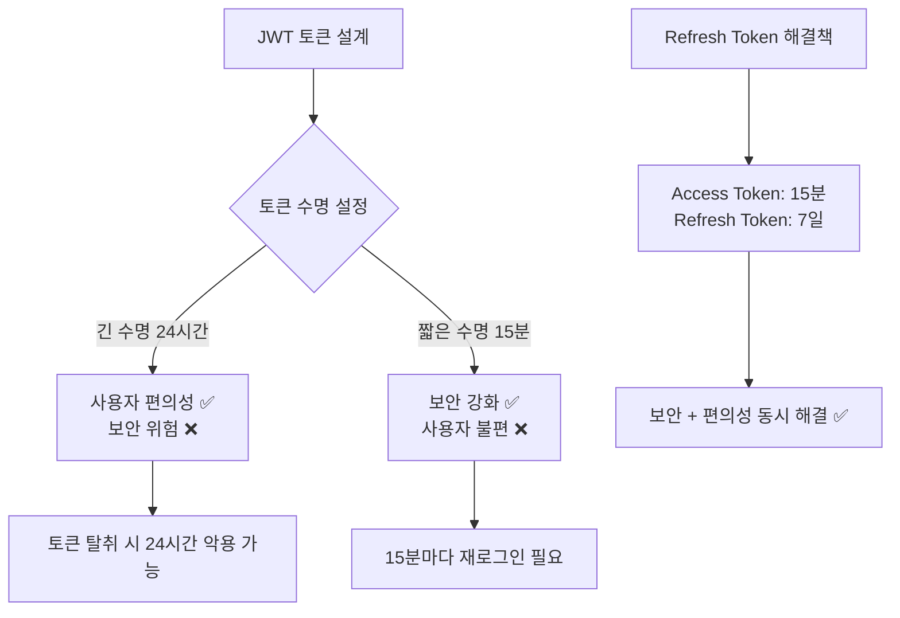
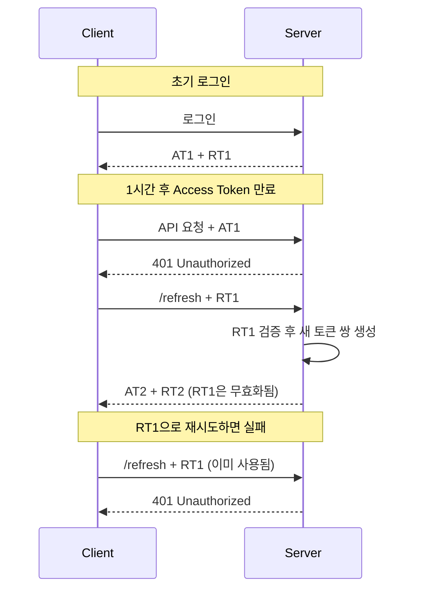

# Refresh Token 가이드

## 📋 개요

JWT 기반 인증 시스템에서 Access Token의 짧은 수명과 사용자 편의성을 동시에 만족시키기 위한 Refresh Token 구현 가이드입니다.

**작성일**: 2025-01-18  
**버전**: 1.0.0  
**작성자**: Commerce 개발팀

---

## 🎯 Refresh Token이 필요한 이유

### **1. JWT의 근본적인 딜레마**



### **2. 보안과 편의성의 균형**

| 방식 | Access Token 수명 | 보안성 | 사용자 편의성 | 탈취 시 위험도 |
|------|-------------------|--------|---------------|----------------|
| **단일 토큰 (긴 수명)** | 24시간 | ⭐⭐ | ⭐⭐⭐⭐⭐ | 🔴 높음 |
| **단일 토큰 (짧은 수명)** | 15분 | ⭐⭐⭐⭐⭐ | ⭐ | 🟡 낮음 |
| **Refresh Token** | 15분 + 7일 | ⭐⭐⭐⭐ | ⭐⭐⭐⭐ | 🟢 매우 낮음 |

---

## 📊 현재 구현 상태

### **✅ 이미 구현된 부분**

1. **토큰 생성**: Access Token과 Refresh Token 모두 생성됨
2. **토큰 응답**: 로그인 시 두 토큰 모두 클라이언트에 전달
3. **토큰 구조**: JTI 포함하여 블랙리스트 지원

```java
// 현재 LoginResponse
public record LoginResponse(
    String accessToken,     // ✅ 생성됨
    String refreshToken,    // ✅ 생성됨  
    String tokenType,       // ✅ "Bearer"
    long expiresIn          // ✅ Access Token 만료시간
)
```

### **❌ 미구현된 부분**

1. **Refresh 엔드포인트**: 더미 구현만 존재
2. **토큰 갱신 로직**: 실제 갱신 기능 없음
3. **클라이언트 자동 갱신**: 프론트엔드 구현 필요

```java
// 현재 상태 (더미)
@PostMapping("/refresh")
public ResponseEntity<String> refresh() {
    return ResponseEntity.ok("리프레시 토큰 발급 성공");  // ❌ 실제 로직 없음
}
```

---

## 🏗️ 완전한 구현 방법

### **1. Refresh 요청/응답 DTO**

```java
// RefreshRequest.java
package innercircle.member.domain.auth;

public record RefreshRequest(String refreshToken) {
    public RefreshRequest {
        if (refreshToken == null || refreshToken.isBlank()) {
            throw new IllegalArgumentException("Refresh token cannot be null or blank");
        }
    }
}

// RefreshResponse.java  
package innercircle.member.domain.auth;

public record RefreshResponse(
        String accessToken,
        String refreshToken,  // 새로운 refresh token (토큰 순환)
        String tokenType,
        long expiresIn
) {
    public RefreshResponse {
        if (accessToken == null || accessToken.isBlank()) {
            throw new IllegalArgumentException("Access token cannot be null or blank");
        }
        if (refreshToken == null || refreshToken.isBlank()) {
            throw new IllegalArgumentException("Refresh token cannot be null or blank");
        }
    }
}
```

### **2. TokenPort 확장**

```java
// TokenPort.java에 추가
/**
 * 토큰 타입 검증
 */
boolean isRefreshToken(String token);

/**
 * Refresh Token에서 사용자 정보 추출
 */
Long getUserIdFromRefreshToken(String refreshToken);
String getEmailFromRefreshToken(String refreshToken);
List<String> getRolesFromRefreshToken(String refreshToken);
```

### **3. JwtTokenAdapter 확장**

```java
// JwtTokenAdapter.java에 추가
@Override
public boolean isRefreshToken(String token) {
    try {
        Claims claims = getClaimsFromToken(token);
        String tokenType = claims.get("type", String.class);
        return "REFRESH".equals(tokenType);
    } catch (Exception e) {
        log.warn("토큰 타입 확인 실패: {}", e.getMessage());
        return false;
    }
}

@Override
public Long getUserIdFromRefreshToken(String refreshToken) {
    Claims claims = getClaimsFromToken(refreshToken);
    
    // Refresh Token 타입 확인
    String tokenType = claims.get("type", String.class);
    if (!"REFRESH".equals(tokenType)) {
        throw new IllegalArgumentException("이 토큰은 Refresh Token이 아닙니다");
    }
    
    return Long.valueOf(claims.getSubject());
}

@Override
public String getEmailFromRefreshToken(String refreshToken) {
    Claims claims = getClaimsFromToken(refreshToken);
    
    String tokenType = claims.get("type", String.class);
    if (!"REFRESH".equals(tokenType)) {
        throw new IllegalArgumentException("이 토큰은 Refresh Token이 아닙니다");
    }
    
    return claims.get("email", String.class);
}

@Override
public List<String> getRolesFromRefreshToken(String refreshToken) {
    Claims claims = getClaimsFromToken(refreshToken);
    
    String tokenType = claims.get("type", String.class);
    if (!"REFRESH".equals(tokenType)) {
        throw new IllegalArgumentException("이 토큰은 Refresh Token이 아닙니다");
    }
    
    String roles = claims.get("roles", String.class);
    return List.of(roles.split(","));
}
```

### **4. AuthUseCase 확장**

```java
// AuthUseCase.java에 추가
public interface AuthUseCase {
    LoginResponse login(LoginRequest request);
    RefreshResponse refresh(RefreshRequest request);  // ✅ 추가
}
```

### **5. AuthApplicationService 구현**

```java
// AuthApplicationService.java에 추가
@Override
public RefreshResponse refresh(RefreshRequest request) {
    try {
        // 1. Refresh Token 검증
        if (!tokenPort.validateToken(request.refreshToken())) {
            throw new IllegalArgumentException("유효하지 않은 Refresh Token입니다");
        }
        
        // 2. Refresh Token 타입 확인
        if (!tokenPort.isRefreshToken(request.refreshToken())) {
            throw new IllegalArgumentException("Access Token으로는 갱신할 수 없습니다");
        }
        
        // 3. 사용자 정보 추출
        Long userId = tokenPort.getUserIdFromRefreshToken(request.refreshToken());
        String email = tokenPort.getEmailFromRefreshToken(request.refreshToken());
        List<String> roles = tokenPort.getRolesFromRefreshToken(request.refreshToken());
        
        // 4. 새로운 토큰 쌍 생성 (토큰 순환)
        String newAccessToken = tokenPort.generateAccessToken(userId, email, roles);
        String newRefreshToken = tokenPort.generateRefreshToken(userId, email, roles);
        
        log.info("🔄 토큰 갱신 성공: userId={}, email={}", userId, email);
        
        return new RefreshResponse(
                newAccessToken,
                newRefreshToken,    // ✅ 새 Refresh Token (보안 강화)
                TOKEN_TYPE_BEARER,
                accessTokenExpiry
        );
        
    } catch (Exception e) {
        log.error("🚫 토큰 갱신 실패: {}", e.getMessage());
        throw new IllegalArgumentException("토큰 갱신에 실패했습니다: " + e.getMessage());
    }
}
```

### **6. AuthController 완성**

```java
// AuthController.java 수정
@PostMapping("/refresh")
public ResponseEntity<RefreshResponse> refresh(@RequestBody RefreshRequest request) {
    try {
        RefreshResponse response = authUseCase.refresh(request);
        
        return ResponseEntity.ok()
                .header("X-Content-Type-Options", "nosniff")
                .header("X-Frame-Options", "DENY") 
                .header("Cache-Control", "no-store, no-cache, must-revalidate")
                .body(response);
                
    } catch (IllegalArgumentException e) {
        log.warn("🚫 토큰 갱신 실패: {}", e.getMessage());
        return ResponseEntity.status(HttpStatus.UNAUTHORIZED)
                .body(new RefreshResponse(null, null, null, 0));
    }
}
```

---

## 🔄 토큰 순환 (Token Rotation)

### **보안 강화 메커니즘**



**토큰 순환의 장점:**
- 🔄 **Refresh Token도 갱신**: 탈취 위험 감소
- 🚫 **한 번 사용한 토큰 무효화**: 재사용 방지
- 🔍 **이상 탐지**: 동시 사용 시 감지 가능

---

## 📱 클라이언트 구현 가이드

### **1. 토큰 저장 관리**

```javascript
// TokenManager.js
class TokenManager {
    // 토큰 저장
    static setTokens(accessToken, refreshToken, expiresIn) {
        localStorage.setItem('accessToken', accessToken);
        localStorage.setItem('refreshToken', refreshToken);
        localStorage.setItem('tokenExpiry', Date.now() + expiresIn);
    }
    
    // 토큰 조회
    static getAccessToken() {
        return localStorage.getItem('accessToken');
    }
    
    static getRefreshToken() {
        return localStorage.getItem('refreshToken');
    }
    
    // 만료 체크
    static isAccessTokenExpired() {
        const expiry = localStorage.getItem('tokenExpiry');
        return Date.now() > parseInt(expiry || '0');
    }
    
    // 토큰 삭제
    static clearTokens() {
        localStorage.removeItem('accessToken');
        localStorage.removeItem('refreshToken');
        localStorage.removeItem('tokenExpiry');
    }
}
```

### **2. 자동 토큰 갱신 API 클라이언트**

```javascript
// ApiClient.js
class ApiClient {
    constructor() {
        this.baseURL = 'http://localhost:8000';
        this.isRefreshing = false;
        this.failedQueue = [];
    }
    
    // 메인 API 호출 메서드
    async request(url, options = {}) {
        let accessToken = TokenManager.getAccessToken();
        
        // 첫 번째 시도
        let response = await this.makeRequest(url, accessToken, options);
        
        // 401 에러 = 토큰 만료
        if (response.status === 401 && !this.isRefreshing) {
            console.log('🔄 Access Token 만료, Refresh 시도');
            
            // 토큰 갱신
            const refreshed = await this.refreshToken();
            
            if (refreshed) {
                // 갱신된 토큰으로 재시도
                accessToken = TokenManager.getAccessToken();
                response = await this.makeRequest(url, accessToken, options);
            } else {
                // Refresh 실패 → 로그인 페이지로
                this.redirectToLogin();
                return null;
            }
        }
        
        return response;
    }
    
    // 실제 HTTP 요청
    async makeRequest(url, accessToken, options) {
        return fetch(`${this.baseURL}${url}`, {
            ...options,
            headers: {
                ...options.headers,
                'Authorization': `Bearer ${accessToken}`,
                'Content-Type': 'application/json'
            }
        });
    }
    
    // 토큰 갱신
    async refreshToken() {
        if (this.isRefreshing) {
            // 이미 갱신 중이면 대기
            return new Promise((resolve) => {
                this.failedQueue.push(resolve);
            });
        }
        
        this.isRefreshing = true;
        const refreshToken = TokenManager.getRefreshToken();
        
        if (!refreshToken) {
            this.isRefreshing = false;
            return false;
        }
        
        try {
            const response = await fetch(`${this.baseURL}/api/member-service/auth/refresh`, {
                method: 'POST',
                headers: { 'Content-Type': 'application/json' },
                body: JSON.stringify({ refreshToken })
            });
            
            if (response.ok) {
                const data = await response.json();
                
                // 새 토큰들 저장
                TokenManager.setTokens(
                    data.accessToken,
                    data.refreshToken,  // 새 Refresh Token
                    data.expiresIn
                );
                
                // 대기 중인 요청들 처리
                this.processQueue(true);
                
                console.log('✅ 토큰 갱신 성공');
                return true;
            } else {
                console.log('❌ Refresh Token도 만료됨');
                this.processQueue(false);
                return false;
            }
        } catch (error) {
            console.error('❌ 토큰 갱신 실패:', error);
            this.processQueue(false);
            return false;
        } finally {
            this.isRefreshing = false;
        }
    }
    
    // 대기 중인 요청들 처리
    processQueue(success) {
        this.failedQueue.forEach(resolve => resolve(success));
        this.failedQueue = [];
    }
    
    redirectToLogin() {
        TokenManager.clearTokens();
        window.location.href = '/login';
    }
}

// 전역 인스턴스
const apiClient = new ApiClient();
export default apiClient;
```

### **3. Vue.js/React 컴포넌트에서 사용**

```javascript
// UserProfile.vue (Vue 3 예시)
<template>
  <div v-if="user">
    <h1>{{ user.name }}</h1>
    <p>{{ user.email }}</p>
  </div>
  <div v-else-if="loading">
    로딩 중...
  </div>
  <div v-else>
    로그인이 필요합니다.
  </div>
</template>

<script setup>
import { ref, onMounted } from 'vue';
import apiClient from '@/utils/ApiClient';

const user = ref(null);
const loading = ref(true);

onMounted(async () => {
  try {
    // 자동 토큰 갱신이 포함된 API 호출
    const response = await apiClient.request('/api/member-service/members/me');
    
    if (response && response.ok) {
      user.value = await response.json();
    }
  } catch (error) {
    console.error('사용자 정보 조회 실패:', error);
  } finally {
    loading.value = false;
  }
});
</script>
```

---

## 🧪 테스트 방법

### **1. 수동 테스트**

```bash
# 1. 로그인
POST http://localhost:8000/api/member-service/auth/login
Content-Type: application/json

{
  "email": "test@example.com",
  "password": "password123"
}

# 응답에서 refreshToken 저장

# 2. 토큰 갱신 테스트
POST http://localhost:8000/api/member-service/auth/refresh
Content-Type: application/json

{
  "refreshToken": "eyJhbGciOiJIUzUxMiJ9.eyJzdWIiOiIxMjM0NTY..."
}

# 예상 응답
{
  "accessToken": "eyJhbGciOiJIUzUxMiJ9.NEW_ACCESS_TOKEN...",
  "refreshToken": "eyJhbGciOiJIUzUxMiJ9.NEW_REFRESH_TOKEN...",
  "tokenType": "Bearer", 
  "expiresIn": 3600000
}

# 3. 이전 Refresh Token으로 재시도 (실패해야 함)
POST http://localhost:8000/api/member-service/auth/refresh
Content-Type: application/json

{
  "refreshToken": "eyJhbGciOiJIUzUxMiJ9.OLD_REFRESH_TOKEN..."
}

# 예상: 401 Unauthorized
```

### **2. 자동화 테스트**

```java
// RefreshTokenTest.java
@SpringBootTest
@AutoConfigureTestDatabase(replace = AutoConfigureTestDatabase.Replace.NONE)
class RefreshTokenTest {
    
    @Autowired
    private AuthUseCase authUseCase;
    
    @Test
    void refresh_token으로_새_토큰_발급_성공() {
        // Given: 로그인
        LoginRequest loginRequest = new LoginRequest("test@example.com", "password123");
        LoginResponse loginResponse = authUseCase.login(loginRequest);
        
        // When: Refresh Token으로 갱신
        RefreshRequest refreshRequest = new RefreshRequest(loginResponse.refreshToken());
        RefreshResponse refreshResponse = authUseCase.refresh(refreshRequest);
        
        // Then: 새 토큰들 발급됨
        assertThat(refreshResponse.accessToken()).isNotNull();
        assertThat(refreshResponse.refreshToken()).isNotNull();
        assertThat(refreshResponse.accessToken()).isNotEqualTo(loginResponse.accessToken());
        assertThat(refreshResponse.refreshToken()).isNotEqualTo(loginResponse.refreshToken());
    }
    
    @Test
    void 잘못된_refresh_token으로_갱신_실패() {
        // Given: 잘못된 토큰
        RefreshRequest invalidRequest = new RefreshRequest("invalid.refresh.token");
        
        // When & Then: 예외 발생
        assertThatThrownBy(() -> authUseCase.refresh(invalidRequest))
                .isInstanceOf(IllegalArgumentException.class)
                .hasMessageContaining("유효하지 않은 Refresh Token");
    }
    
    @Test
    void access_token으로_갱신_시도_실패() {
        // Given: Access Token으로 갱신 시도
        LoginRequest loginRequest = new LoginRequest("test@example.com", "password123");
        LoginResponse loginResponse = authUseCase.login(loginRequest);
        
        RefreshRequest invalidRequest = new RefreshRequest(loginResponse.accessToken());
        
        // When & Then: 예외 발생  
        assertThatThrownBy(() -> authUseCase.refresh(invalidRequest))
                .isInstanceOf(IllegalArgumentException.class)
                .hasMessageContaining("Access Token으로는 갱신할 수 없습니다");
    }
}
```

---

## 🔐 보안 고려사항

### **1. 토큰 저장 위치**

| 저장 위치 | 보안성 | 사용 편의성 | XSS 위험 | CSRF 위험 | 권장 용도 |
|-----------|--------|-------------|----------|-----------|-----------|
| **localStorage** | ⭐⭐ | ⭐⭐⭐⭐⭐ | 높음 | 낮음 | Access Token |
| **sessionStorage** | ⭐⭐⭐ | ⭐⭐⭐⭐ | 높음 | 낮음 | 임시 토큰 |
| **HttpOnly Cookie** | ⭐⭐⭐⭐⭐ | ⭐⭐⭐ | 낮음 | 높음 | Refresh Token |
| **Memory** | ⭐⭐⭐⭐ | ⭐⭐ | 낮음 | 낮음 | 임시 사용 |

### **2. 권장 하이브리드 방식**

```javascript
// 보안 강화 저장 전략
class SecureTokenManager {
    // Access Token: localStorage (자주 사용, 짧은 수명)
    static setAccessToken(token, expiresIn) {
        localStorage.setItem('accessToken', token);
        localStorage.setItem('tokenExpiry', Date.now() + expiresIn);
    }
    
    // Refresh Token: HttpOnly Cookie로 서버에서 설정
    // 클라이언트 JavaScript에서 접근 불가 → XSS 방어
}
```

### **3. 추가 보안 조치**

```java
// 서버 사이드 보안 강화
@PostMapping("/refresh")
public ResponseEntity<RefreshResponse> refresh(
    @RequestBody RefreshRequest request,
    HttpServletRequest httpRequest,
    HttpServletResponse httpResponse) {
    
    try {
        // IP 주소 검증 (선택사항)
        String clientIp = getClientIpAddress(httpRequest);
        validateClientIp(clientIp, request.refreshToken());
        
        RefreshResponse response = authUseCase.refresh(request);
        
        // 새 Refresh Token을 HttpOnly Cookie로 설정
        Cookie refreshCookie = new Cookie("refreshToken", response.refreshToken());
        refreshCookie.setHttpOnly(true);    // XSS 방어
        refreshCookie.setSecure(true);      // HTTPS 전용
        refreshCookie.setSameSite("Strict"); // CSRF 방어
        refreshCookie.setMaxAge(7 * 24 * 3600); // 7일
        httpResponse.addCookie(refreshCookie);
        
        // 응답에서는 Access Token만 포함
        return ResponseEntity.ok(new RefreshResponse(
            response.accessToken(),
            null,  // Refresh Token은 쿠키로만 전달
            response.tokenType(),
            response.expiresIn()
        ));
        
    } catch (Exception e) {
        return ResponseEntity.status(HttpStatus.UNAUTHORIZED).build();
    }
}
```

---

## 📈 성능 최적화

### **1. 토큰 캐싱**

```java
// 토큰 검증 결과 캐싱 (선택사항)
@Service
public class CachedTokenService {
    private final LoadingCache<String, Boolean> tokenValidityCache;
    
    public CachedTokenService() {
        this.tokenValidityCache = Caffeine.newBuilder()
                .maximumSize(10000)
                .expireAfterWrite(5, TimeUnit.MINUTES)  // 5분 캐시
                .build(this::validateTokenInternal);
    }
    
    public boolean isTokenValid(String token) {
        return tokenValidityCache.get(token);
    }
}
```

### **2. 클라이언트 최적화**

```javascript
// 토큰 만료 시간 기반 사전 갱신
class ProactiveTokenManager {
    static shouldRefreshToken() {
        const expiry = localStorage.getItem('tokenExpiry');
        const now = Date.now();
        const expiryTime = parseInt(expiry || '0');
        
        // 만료 5분 전에 갱신
        return (expiryTime - now) < (5 * 60 * 1000);
    }
    
    static async ensureValidToken() {
        if (this.shouldRefreshToken()) {
            await apiClient.refreshToken();
        }
    }
}
```

---

## 🚨 문제 해결

### **1. 자주 발생하는 문제들**

| 문제 | 원인 | 해결방법 |
|------|------|----------|
| **토큰 갱신 실패** | Refresh Token 만료/변조 | 재로그인 유도 |
| **무한 갱신 루프** | 잘못된 토큰 타입 확인 | 토큰 타입 검증 강화 |
| **동시 갱신 요청** | 여러 API 동시 호출 | 갱신 중 플래그 사용 |
| **CORS 에러** | 크로스 도메인 쿠키 | SameSite 설정 조정 |

### **2. 디버깅 방법**

```javascript
// 토큰 상태 디버깅
function debugTokenStatus() {
    const accessToken = TokenManager.getAccessToken();
    const refreshToken = TokenManager.getRefreshToken();
    const expiry = localStorage.getItem('tokenExpiry');
    
    console.log('=== 토큰 상태 ===');
    console.log('Access Token:', accessToken ? 'Exists' : 'Missing');
    console.log('Refresh Token:', refreshToken ? 'Exists' : 'Missing');
    console.log('만료 시간:', new Date(parseInt(expiry || '0')));
    console.log('현재 시간:', new Date());
    console.log('만료까지:', Math.round((parseInt(expiry || '0') - Date.now()) / 1000 / 60), '분');
    
    // JWT 페이로드 디코딩 (개발용)
    if (accessToken) {
        try {
            const payload = JSON.parse(atob(accessToken.split('.')[1]));
            console.log('Access Token 정보:', payload);
        } catch (e) {
            console.log('토큰 디코딩 실패');
        }
    }
}

// 브라우저 콘솔에서 호출: debugTokenStatus()
```

---

## 🎯 구현 체크리스트

### **백엔드 (Member Service)**

- [ ] RefreshRequest/RefreshResponse DTO 생성
- [ ] TokenPort 인터페이스에 refresh 관련 메서드 추가
- [ ] JwtTokenAdapter에 토큰 타입 검증 로직 구현
- [ ] AuthUseCase에 refresh 메서드 추가
- [ ] AuthApplicationService에 갱신 로직 구현
- [ ] AuthController refresh 엔드포인트 완성
- [ ] 토큰 순환 로직 구현
- [ ] 에러 핸들링 및 로깅 추가
- [ ] 단위 테스트 작성

### **프론트엔드**

- [ ] TokenManager 클래스 구현
- [ ] ApiClient에 자동 갱신 로직 추가
- [ ] 동시 요청 처리 로직 구현
- [ ] 401 에러 인터셉터 설정
- [ ] 로그인 페이지 리다이렉트 로직
- [ ] 토큰 만료 알림 UI (선택사항)
- [ ] 디버깅 도구 추가

### **보안 강화 (선택사항)**

- [ ] HttpOnly Cookie 방식 구현
- [ ] IP 주소 검증
- [ ] Rate Limiting 적용
- [ ] 토큰 블랙리스트 연동
- [ ] 감사 로그 기록

---

## 📚 관련 문서

- [JWT_SECURITY_GUIDE.md](./JWT_SECURITY_GUIDE.md) - JWT 보안 가이드
- [JWT_IMPLEMENTATION_GUIDE_250818.md](./JWT_IMPLEMENTATION_GUIDE_250818.md) - JWT 구현 가이드
- [../../../infra/gateway/docs/JWT_AUTHENTICATION_GUIDE.md](../../../infra/gateway/docs/JWT_AUTHENTICATION_GUIDE.md) - Gateway 인증 가이드

---

## 🔄 변경 이력

| 버전 | 날짜         | 변경 내용 | 작성자 |
|------|------------|-----------|--------|
| 1.0.0 | 2025-08-26 | 초기 문서 작성 | Commerce 개발팀 |

---

**Refresh Token을 통해 사용자는 7일간 편리하게 서비스를 이용하면서도, 높은 보안성을 유지할 수 있습니다!** 🔐✨
